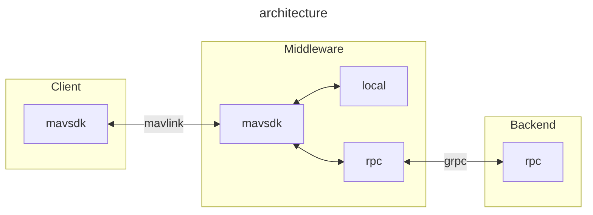

# MAVCam

## Basic architecture


### Format code request

First need install clang-format-15 for format code, in **ubuntu** you can use the following command to install clang-format-15

```shell
sudo apt install clang-format-15
```

then use the tools/fix_style.sh to format the source dir

```
./tools/fix_style.sh ./src
```

