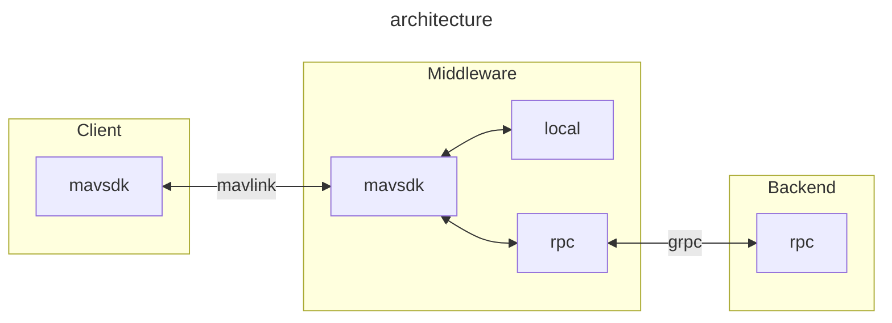

# MAVCam

## Basic architecture

```mermaid
---
title: architecture
---
flowchart LR
    subgraph Client
    C1[mavsdk]
    end
    
    subgraph Middleware
    M1[mavsdk]
    M2[local]
    M3[rpc]
    M1 <--> M2
    M1 <--> M3
    end

    subgraph Backend
    B1[rpc]
    end

    C1 <-->|mavlink| M1
    M3 <--> |grpc| B1
```
